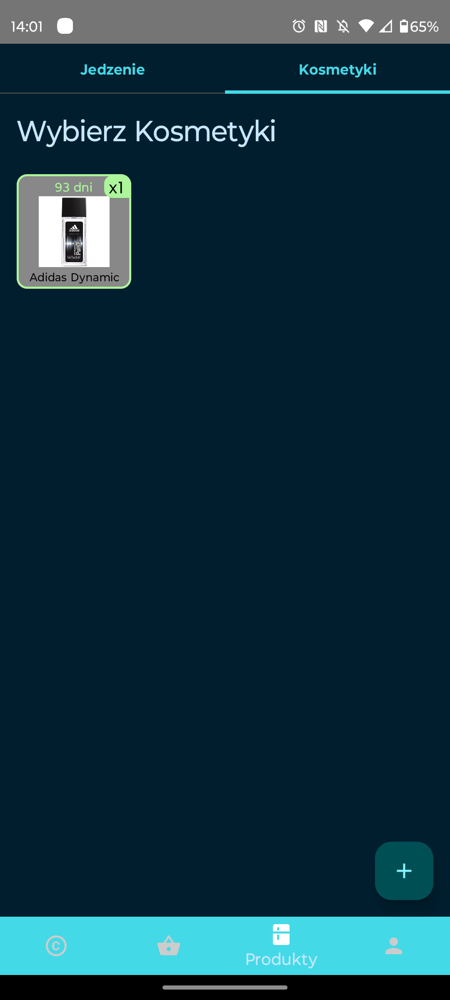

# FreshGuard - Your Smart Fridge Companion

FreshGuard is a versatile and user-friendly mobile application designed to help you manage your kitchen and skincare products efficiently. With features like user registration, login, and local multi-user support, FreshGuard makes it easy to keep track of your items and their expiration dates, ensuring you never waste another product.

## Key Features

### User Management
- **Registration and Login**: Create your personal account and securely log in to FreshGuard. Multiple users can manage their own inventories on the same device.

### Virtual Fridge and Cosmetic Shelf View
- **Keep Track of Your Products**: Get an organized view of your virtual fridge and cosmetic shelf. Easily categorize and manage your items.

### Quick Product Addition
- **Manual Entry**: Add items to the app by manually filling in the necessary details, including product name, category, and expiration date.
- **QR Code Scanning**: Effortlessly import products by scanning QR codes on their packaging.

### Expiration Date Reminders
- **Stay Informed**: FreshGuard automatically tracks the expiration dates of your items and sends you timely reminders, ensuring you use products before they expire.

### Shopping List Integration
- **Seamless Shopping**: When you remove a product from your virtual fridge or cosmetic shelf, you can conveniently add it to your shopping list with just a few taps.

## Technologies Used

FreshGuard is built using the following technologies:

- Kotlin
- Jetpack Compose
- Coroutines
- Room Database

## Screenshots:

    
    
    
    

    
    
    
    

## Authors:
[@majsterkovic](https://www.github.com/majsterkovic) & [@mpietr](https://www.github.com/mpietr)